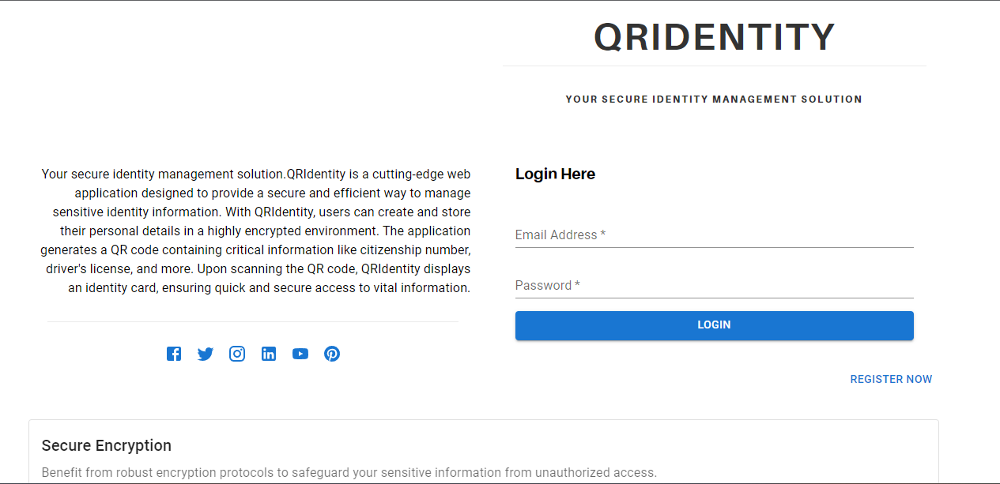

# SETUP MONGODB CLUSTER AND CREDENTIALS BEFORE USING THE BACKEND FEATURES ! 
Make sure you create / edit the .env file in server/.env 

# QRIdentity
QRIdentity is a cutting-edge identity verification platform that leverages QR code technology to enhance security and streamline authentication processes. It offers a seamless and secure way to generate personalized QR codes containing vital identification information such as citizenship numbers, license details etc. Your information, your control.

# QRIdentity

Introduction
QRIdentity is a powerful identity verification platform that utilizes QR code technology to provide secure and efficient authentication processes. It enables users to generate personalized QR codes containing crucial identification information, such as citizenship numbers, driver's license details, and more. With QRIdentity, sharing and verifying credentials becomes a breeze, ensuring trust and efficiency in various scenarios.

Features
Generate personalized QR codes with essential identification details.
Share and verify credentials securely.
Enhance security and streamline authentication processes.

# Getting Started
Prerequisites
Node.js and npm installed on your system.

Installation
Clone the repository:

git clone [https://github.com/your-username/QRIdentity.git] (https://github.com/BishwasGit/QRIdentity)

# Install the dependencies:

cd QRIdentity
npm install

Start the development server:
npm start

Connect to mongo db 
node server.js 

# Usage
Visit the QRIdentity website.(localhost:3000)

Create an account or log in if you already have one.
Generate a QR code with your identification details.
Share the QR code whenever needed for verification.

# Contributing
We welcome contributions from the community! Please check out our Contribution Guidelines for more details.

# Acknowledgements
Special thanks to OpenAI for their amazing language models.

# Contact
For inquiries or support, please contact us at workmail.bishwas@gmail.com
